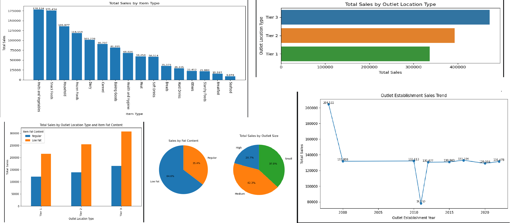

# Blinkit-Sales-Customer-Insights-Analysis
Python-based Blinkit data analysis project focusing on sales trends, customer insights, and data-driven decision making

# 🛒 Blinkit Sales Data Analysis (Python Project)

## 📌 Project Overview
This project focuses on performing an in-depth Exploratory Data Analysis (EDA) on Blinkit's sales dataset using Python. The aim is to extract meaningful insights related to sales performance, customer preferences, and product distribution.

The project demonstrates strong data analysis skills including data cleaning, KPI evaluation, and visualization.

---

## 🎯 Business Objective
- Analyze overall sales performance
- Understand customer behavior and preferences
- Identify top-performing product categories
- Evaluate the impact of outlet type, size, and location on sales
- Generate actionable insights using data visualization

---

## 📊 Key Performance Indicators (KPIs)

- **💰 Total Sales**  
  Total revenue generated from all items sold.

- **📈 Average Sales**  
  Average revenue per transaction.

- **📦 Number of Items Sold**  
  Total count of items sold.

- **⭐ Average Rating**  
  Average customer rating of products.

---

## 🧹 Data Cleaning & Preprocessing
- Handled missing values
- Standardized categorical data (e.g., Low Fat, Regular)
- Removed duplicates
- Converted data types for analysis

---

## 📈 Exploratory Data Analysis (EDA)

### 🔹 1. Sales by Fat Content
- **Objective:** Analyze how fat content affects total sales
- **Visualization:** Pie Chart

---

### 🔹 2. Sales by Item Type
- **Objective:** Identify top-performing product categories
- **Visualization:** Bar Chart

---

### 🔹 3. Sales by Outlet Location
- **Objective:** Compare sales across Tier 1, Tier 2, and Tier 3 cities
- **Visualization:** Bar Chart

---

### 🔹 4. Sales by Outlet Establishment Year
- **Objective:** Analyze trends based on outlet age
- **Visualization:** Line Chart

---

### 🔹 5. Sales by Outlet Size
- **Objective:** Understand how outlet size impacts sales
- **Visualization:** Pie Chart

### 🔹 6 .Total Sales by Outlet Location Type
- ** Objective: Analyze total sales distribution across different outlet location types to identify top-performing locations
- **Visualization: Horizontal Bar Chart

---

## ⚙️ Technologies Used
- **Python**
- **Pandas** – Data manipulation and analysis  
- **NumPy** – Numerical computations  
- **Matplotlib** – Data visualization  
- **Seaborn** – Advanced visualizations  
- **Jupyter Notebook**

---

## 📊 Key Insights
- A few product categories contribute significantly to overall sales.
- Outlet size and location strongly influence revenue generation.
- Customer ratings show a noticeable relationship with sales trends.
- Tier-based cities exhibit different purchasing behaviors.

---

## 🚀 Project Workflow
1. Data Collection  
2. Data Cleaning  
3. Exploratory Data Analysis (EDA)  
4. KPI Calculation  
5. Data Visualization  
6. Insights Generation  

---

## 📁 Project Structure

Blinkit-Analysis/
│
├── data/
│   └── blinkit_data.csv
├── notebooks/
│   └── analysis.ipynb
├── images/
│   └── charts.png
├── README.md

---
## ▶️ How to Run the Project

1. Clone the repository
2. Install dependencies  
3. Run the Jupyter Notebook  
